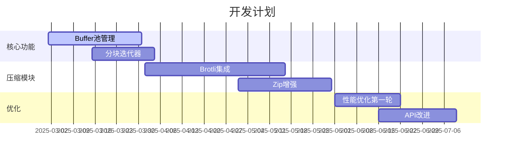

# 流处理库增强计划

## 一、核心功能扩展 (Phase 1)

### 1. Buffer池管理
```typescript
// 示例接口设计
interface BufferPool {
  acquire(size: number): ArrayBuffer;
  release(buffer: ArrayBuffer): void;
  stats(): { total: number; used: number };
}

实现步骤：
1. 创建BufferPool接口及基础实现类
2. 实现LRU缓存策略
3. 添加线程安全包装器
//4. 集成到MemoryStream/MemfdStream
5. 添加单元测试
```

### 2. 分块迭代器
```typescript
class ChunkIterator implements AsyncIterable<Uint8Array> {
  constructor(
    private stream: base.IStream,
    private chunkSize: number = 1024 * 1024
  ) {}

  [Symbol.asyncIterator](): AsyncIterator<Uint8Array> {
    // 实现分块读取逻辑
  }
}

实现步骤：
1. 定义迭代器接口
2. 实现同步/异步两种迭代模式
3. 集成到IStream接口扩展
4. 添加流异常处理机制
5. 编写使用示例
```

## 二、压缩模块增强 (Phase 2)

### 1. Brotli压缩支持
```typescript
class BrotliStream implements base.IStream {
  // 压缩流实现
}

实现步骤：
1. 编译Brotli C++库到Native层
2. 设计ArkTS接口
3. 实现压缩/解压流
4. 添加性能测试用例
5. 文档示例更新
```

### 2. Zip增强功能
```markdown
- [ ] AES-256加密支持
   ▸ 修改ZipCryptoStream实现
   ▸ 添加加密算法选择参数
   ▸ 兼容传统Zip加密

- [ ] 分卷压缩
   ▸ 实现VolumeSplitter接口
   ▸ 添加分卷大小配置
   ▸ 处理跨卷文件存储
```

## 三、API优化 (Phase 3)

### 1. 链式操作支持
```typescript
stream.pipeThrough(transformStream)
      .pipeTo(destinationStream)
      .then(() => console.log("Done"));

实现步骤：
1. 扩展IStream接口
2. 实现PipeController类
3. 添加错误传播机制
4. 优化内存管理
5. 性能基准测试
```

### 2. 自动关闭语法糖
```typescript
function withStream(stream: base.IStream, callback: (s: base.IStream) => void) {
  try {
    callback(stream);
  } finally {
    stream.close();
  }
}
```

## 四、性能优化 (Ongoing)

| 优化项          | 实施步骤                              | 目标提升 |
|----------------|-------------------------------------|--------|
| 零拷贝访问      | 1. 实现Buffer视图共享机制            | 40%    |
| 异步流水线      | 2. 优化libuv线程池使用               | 30%    |
| SIMD加速        | 3. 实现ARM NEON优化版本              | 50%    |

## 五、实施路线图



## 六、文档计划

1. 新增《高级用法指南》
2. 编写性能优化白皮书
3. 添加开发者API参考
4. 录制实战教学视频
5. 完善错误代码手册
