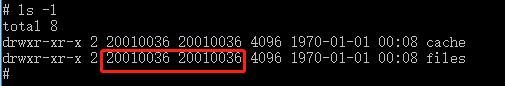
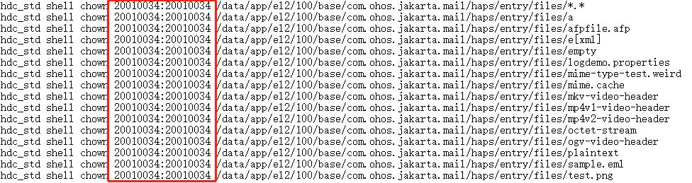

#### 执行步骤
1. 配置hdc_std 环境变量
2. 安装hap包
3. 执行testFile文件夹下面的pushFile.bat 脚本

####注意问题：
* 进入设备data/app/el2/100/base/cn.openharmony.mail/haps/entry/  目录下
* 执行 ls -l 查看files文件夹的权限是否为 20010034 如下

   
* 如果不是权限20010034，需要逐行修改testFile文件夹下面的pushFile.bat脚本中的
   权限修改为设备的对应的权限，然后再运行脚本。

   