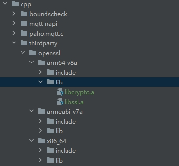

# ohos_mqtt

## Description
This module enables applications to connect to MQTT brokers to publish messages, subscribe to topics, and receive published messages.

## How to Install

```shell
ohpm install @ohos/mqtt
```


- The @ohos/mqtt package has enabled the SSL function and supports the sslVersion parameter.
- For details, see [Installing an OpenHarmony HAR](https://gitcode.com/openharmony-tpc/docs/blob/master/OpenHarmony_har_usage.en.md).

## Source Code Downloading
This project depends on the `paho.mqtt.c` and `third_party_bounds_checking_function` libraries, which are introduced through `git submodule`. You need to specify `--recursive` when downloading the code.
  ```
  git clone --recursive https://gitcode.com/openharmony-tpc/ohos_mqtt.git
  ```
To use the `sslVersion` parameter to set the TLS version supported by the SSL/TLS context, go to the `ohos_Mqtt\src\main\cpp\paho.mqtt.c` directory and run the `modify.sh` script to integrate the patch file in this directory into the `paho.mqtt.c` source code.
## Configuring the x86 Simulator

See [Running Your App/Service on an Emulator](https://developer.huawei.com/consumer/cn/deveco-developer-suite/enabling/kit?currentPage=1&pageSize=100).


## How to Use

```typescript
    import { MqttAsync } from '@ohos/mqtt';
    // or
    // import { MqttClient } from '@ohos/mqtt';
```

## Running the Demo
MQTT depends on the MQTT broker. Use a cloud service or set up the MQTT broker by yourself. To make sure that the demo runs properly, change the values of the following parameters in the `emqxPage.ets` file to the corresponding values.

```typescript
    // Set Client Configuration
@State topic: string = '';
@State payload: string = '';
@State url: string = '';
@State clientId: string = '';
@State userName: string = "";
@State password: string = "";
@State isMQTTV5: boolean = true;
```
Replace `domain:port` in xts with the correct domain name and port number so that xts can run properly.


### OpenSSL Dependency
If you want to enable the SSL function for ohos_mqtt source code compilation, you need to compile OpenSSL on your own. OpenSSL is integrated into the [HAP](https://gitcode.com/openharmony-sig/tpc_c_cplusplus/blob/master/thirdparty/openssl/docs/hap_integrate.md) of an application.

1. Enable the support of x86_64 for cross compilation.

2. Change the OpenSSL version number in the `HPKBUILD` file.

  ```
  pkgver=OpenSSL_1_1_1t 
  // Change the version number.
  pkgver=openssl-3.4.0
  
  patchflag=true
  //Change the patchflag
  patchflag=false

  prepare() {
    if $patchflag
  //Change the prepare
  prepare() {
    unset MAKE # Clear the MAKE environment variable
    if $patchflag
  ```

3. Download [OpenSSL 3.4.0](https://github.com/openssl/openssl/archive/refs/tags/openssl-3.4.0.tar.gz), run the following command to obtain the SHA512 value, and replace the content in the SHA512SUM file.

  ```
  sha512num openssl-openssl-3.4.0.tar.gz
  ```

4. Add the `thirdparty` directory to the `cpp` directory and copy the library generated after compilation to the `thirdparty` directory.



5. Add the following statement to `cpp/paho.mqtt.c/CMakeList.txt`:

  ```
  #Enabling SSL
  add_definitions(-DOPENSSL)
  #Adding a Third-Party Library to a Project
  target_link_libraries(pahomqttc PRIVATE ${NATIVERENDER_ROOT_PATH}/thirdparty/openssl/${OHOS_ARCH}/lib/libssl.a)
  target_link_libraries(pahomqttc PRIVATE ${NATIVERENDER_ROOT_PATH}/thirdparty/openssl/${OHOS_ARCH}/lib/libcrypto.a)

  #Add the header file of the third-party library to the project.
  target_include_directories(pahomqttc PRIVATE ${NATIVERENDER_ROOT_PATH}/thirdparty/openssl/${OHOS_ARCH}/include)
  ```

## Available APIs

### MqttClient

new MqttClient(options: MqttAsyncClientOptions): MqttClient

Creates an MQTT client.

Parameters:

| Name      | Type                      | Mandatory      | Description             |
|-----------|--------------------------|----------|-----------------|
| options   | MqttAsyncClientOptions   | Yes       | Client parameters.          |

Return value:

| Type              | Description                              |
|------------------|----------------------------------|
| MqttClient  | MQTT client, which provides the **connect** and **publish** methods.  |

Examples:

```typescript
    this.mqttAsyncClient = new MqttClient({
        url: "ip:port",
        clientId: "e5fatos4jh3l79lndb0bs",
        persistenceType: 1,
        MQTTVersion: 5,
    })
```

### createMqtt

createMqtt(options: MqttAsyncClientOptions): MqttClient

Creates an MQTT client.

Parameters:

| Name      | Type                      | Mandatory      | Description             |
|-----------|--------------------------|----------|-----------------|
| options   | MqttAsyncClientOptions   | Yes       | Client parameters.          |

Return value:

| Type              | Description                              |
|------------------|----------------------------------|
| MqttClient  | MQTT client, which provides the **connect** and **publish** methods.  |

Examples:

```typescript
    this.mqttAsyncClient = MqttAsync.createMqtt({
        url: "ip:port",
        clientId: "e5fatos4jh3l79lndb0bs",
        persistenceType: 1,
        MQTTVersion: 5,
    })
```

### connect
connect(options: MqttConnectOptions, callback: AsyncCallback<MqttResponse>): void

Connect to the MQTT server.

Parameters:

| Name       | Type                                              | Mandatory   | Description                                         |
|------------|--------------------------------------------------|-------|---------------------------------------------|
| options    | MqttConnectOptions                               | Yes    | For details, see [MqttConnectOptions](#mqttconnectoptions). |
| callback   | AsyncCallback< [MqttResponse](#mqttresponse) >   | Yes    | Callback used to return the result.                                       |

Example 1:

```typescript

    let options: MqttConnectOptions = {
        //set userName and password
        userName: "",
        password: "",
        connectTimeout: 30,
        version: 0,
    };
    this.mqttAsyncClient.connect(options, (err: Error, data: MqttResponse) => {
        // to do Something
    });
```

Example 2:

Connection to an SSL port:

```typescript

    let options: MqttConnectOptions = {
        //set userName and password
        userName: "",
        password: "",
        connectTimeout: 30,
        version: 0,
        // If connecting to an SSL port, the following parameters need to be configured
        sslOptions: {
          // true: enable server certificate authentication, false: disable,default is true.
          enableServerCertAuth: true,
          // Sandbox path for CA certificate
          // If enableServerCertAuth is true, a CA certificate needs to be passed
          // If enableServerCertAuth is false, a CA certificate does not need to be passed
          trustStore: fileDir + "/ca.crt"
        }
    };
    this.mqttAsyncClient.connect(options, (err: Error, data: MqttResponse) => {
        // to do Something
    });
```

### connect
connect(options: MqttConnectOptions): Promise<MqttResponse>

Connect to the MQTT server.

Parameters:

| Name      | Type                    | Mandatory    | Description                                              |
|-----------|------------------------|--------|--------------------------------------------------|
| options   | MqttConnectOptions     | Yes     | For details, see [MqttConnectOptions](#mqttconnectoptions).     |

Return value:

| Type                                      | Description                  |
|------------------------------------------|----------------------|
| Promise<[MqttResponse](#mqttresponse)>   | Promise used to return the result. |

Examples:

```typescript

    let options: MqttConnectOptions = {
        //set userName and password
        userName: "",
        password: "",
        connectTimeout: 30,
        version: 0,
    };
    this.mqttAsyncClient.connect(options).then((data: MqttResponse) => {
        console.log("mqtt connect success "+ JSON.stringify(data));
    }).catch((err: MqttResponse) => {
        console.log("mqtt connect fail"+JSON.stringify(err))
    })

    try{
        let result: MqttResponse = await this.mqttAsyncClient.connect(options)
        console.log("mqtt connect success "+ JSON.stringify(result));
    }catch(err){
        console.log("mqtt connect fail "+ JSON.stringify(err));
    }
```

Example 2:

Connection to an SSL port:

```typescript

    let options: MqttConnectOptions = {
        //set userName and password
        userName: "",
        password: "",
        connectTimeout: 30,
        version: 0,
        // If connecting to an SSL port, the following parameters need to be configured
        sslOptions: {
          // true: enable server certificate authentication, false: disable,default is true.
          enableServerCertAuth: true,
          // Sandbox path for CA certificate
          // If enableServerCertAuth is true, a CA certificate needs to be passed
          // If enableServerCertAuth is false, a CA certificate does not need to be passed
          trustStore: fileDir + "/ca.crt"
        }
    };
    this.mqttAsyncClient.connect(options).then((data: MqttResponse) => {
      console.log("mqtt connect success "+ JSON.stringify(data));
    }).catch((err: MqttResponse) => {
      console.log("mqtt connect fail"+JSON.stringify(err))
    })
    
    try{
      let result: MqttResponse = await this.mqttAsyncClient.connect(options)
      console.log("mqtt connect success "+ JSON.stringify(result));
    }catch(err){
      console.log("mqtt connect fail "+ JSON.stringify(err));
    }
```

### publish
publish(options: MqttPublishOptions, callback: AsyncCallback<MqttResponse>): void

Publishes messages.

Parameters:

| Name      | Type                                               | Mandatory    | Description                                         |
|-----------|---------------------------------------------------|--------|---------------------------------------------|
| options   | MqttPublishOptions                                | Yes     | For details, see [MqttPublishOptions](#mqttpublishoptions). |
| callback  | AsyncCallback< [MqttResponse](#mqttresponse) >    | Yes     | Callback used to return the result.                                       |

Examples:

```typescript
    let publishOption: MqttPublishOptions = {
        topic: "domotopic",
        qos: 1,
        payload: "haishangdebing",
    }
    this.mqttAsyncClient.publish(publishOption, (err: Error, data: MqttResponse) => {
        // to do Something
    });
```

### publish
publish(options: MqttPublishOptions): Promise<MqttResponse>

Publishes messages.

Parameters:

| Name      | Type                     | Mandatory    | Description                                             |
|-----------|-------------------------|--------|-------------------------------------------------|
| options   | MqttPublishOptions      | Yes     | For details, see [MqttPublishOptions](#mqttpublishoptions).    |

Return value:

| Type                                      | Description                |
|------------------------------------------|--------------------|
| Promise<[MqttResponse](#mqttresponse)>   | Promise used to return the result. |

Examples:

```typescript
    let publishOption: MqttPublishOptions = {
        topic: "domotopic",
        qos: 1,
        payload: "haishangdebing",
        properties: {
            contentType: "application/json",
            userProperties: [
            ["region", "China"],
            ["type", "JSON"],
            ]
        },
    }
    this.mqttAsyncClient.publish(publishOption, (data: MqttResponse) => {
        console.log("mqtt publish success "+ JSON.stringify(data));
    }).catch((err: MqttResponse) => {
        console.log("mqtt publish fail "+ JSON.stringify(err));
    })

    try{
        let result: MqttResponse = await this.mqttAsyncClient.publish(publishOption)
        console.log("mqtt publish success "+ JSON.stringify(result));
    }catch(err){
        console.log("mqtt publish fail "+ JSON.stringify(err));
    }
```

### subscribe
subscribe(options: MqttSubscribeOptions, callback: AsyncCallback<MqttResponse>): void

Subscribes to a topic.

Parameters:

| Name      | Type                                              | Mandatory    | Description                                             |
|-----------|--------------------------------------------------|--------|-------------------------------------------------|
| options   | MqttSubscribeOptions                             | Yes     | For details, see [MqttSubscribeOptions](#mqttsubscribeoptions). |
| callback  | AsyncCallback< [MqttResponse](#mqttresponse) >   | Yes     | Callback used to return the result.                                           |

Examples:

```typescript
    let subscribeOption: MqttSubscribeOptions = {
        topic: "domotopic",
        qos: 2
    }
    this.mqttAsyncClient.subscribe(subscribeOption, (err: Error, data: MqttResponse) => {
        // to do Something
    });
```

### subscribe
subscribe(options: MqttSubscribeOptions): Promise<MqttResponse>

Subscribes to a topic.

Parameters:

| Name      | Type                      | Mandatory   | Description                                                |
|-----------|--------------------------|-------|----------------------------------------------------|
| options   | MqttSubscribeOptions     | Yes    | For details, see [MqttSubscribeOptions](#mqttsubscribeoptions).   |

Return value:

| Type                                     | Description                |
|-----------------------------------------|--------------------|
| Promise<[MqttResponse](#mqttresponse)>  | Promise used to return the result. |

Examples:

```typescript
    let subscribeOption: MqttSubscribeOptions = {
        topic: "domotopic",
        qos: 2
    }
    this.mqttAsyncClient.subscribe(subscribeOption).then((data: MqttResponse) => {
        console.log("mqtt subscribe success "+ JSON.stringify(result));
    }).catch((err: MqttResponse) => {
        console.log("mqtt subscribe fail "+ JSON.stringify(err));
    })

    try{
        let result: MqttResponse = await this.mqttAsyncClient.subscribe(subscribeOption)
        console.log("mqtt subscribe success "+ JSON.stringify(result));
    }catch(err){
        console.log("mqtt subscribe fail "+ JSON.stringify(err));
    }
```

### unsubscribe
unsubscribe(options: MqttSubscribeOptions, callback: AsyncCallback<MqttResponse>): void

Unsubscribes from a topic.

Parameters:

| Name       | Type                                             | Mandatory      | Description                                             |
|------------|-------------------------------------------------|----------|-------------------------------------------------|
| options    | MqttSubscribeOptions                            | Yes       | For details, see [MqttSubscribeOptions](#mqttsubscribeoptions). |
| callback   | AsyncCallback< [MqttResponse](#mqttresponse) >  | Yes       | Callback used to return the result.                                           |

Examples:

```typescript
    let subscribeOption: MqttSubscribeOptions = {
        topic: "domotopic",
        qos: 2
    }
    this.mqttAsyncClient.unsubscribe(subscribeOption, (err: Error, data: MqttResponse) => {
         // to do Something
    });
```

### unsubscribe
unsubscribe(options: MqttSubscribeOptions): Promise<MqttResponse>

Unsubscribes from a topic.

Parameters:

| Name   | Type                     |Mandatory        | Description                       |
| -------- | ------------------------ | ---------- | --------------------------- |
| options  | MqttSubscribeOptions       | Yes        | For details, see [MqttSubscribeOptions](#mqttsubscribeoptions).    |

Return value:

| Type                                    | Description                  |
|----------------------------------------|----------------------|
| Promise<[MqttResponse](#mqttresponse)> | Promise used to return the result. |

Examples:

```typescript
    let subscribeOption: MqttSubscribeOptions = {
        topic: "domotopic",
        qos: 2
    }
    this.mqttAsyncClient.unsubscribe(subscribeOption).then((data: MqttResponse) => {
        console.log("mqtt unsubscribe success "+ JSON.stringify(result));
    }).catch((err: MqttResponse) => {
        console.log("mqtt unsubscribe fail "+ JSON.stringify(err));
    })

    try{
        let result: MqttResponse = await this.mqttAsyncClient.unsubscribe(subscribeOption)
        console.log("mqtt unsubscribe success "+ JSON.stringify(result));
    }catch(err){
        console.log("mqtt unsubscribe fail "+ JSON.stringify(err));
    }
```

### messageArrived
messageArrived(callback: AsyncCallback<MqttMessage>): void

Represents the callback invoked when messages specific to the subscribed topic are published.

Parameters:

| Name        | Type                                            | Mandatory     | Description        |
|-------------|------------------------------------------------|---------|------------|
| callback    | AsyncCallback< [MqttMessage](#mqttmessage) >   | Yes      | Callback used to return the result.      |

Examples:

```typescript
    this.mqttAsyncClient.messageArrived((err: Error, data: MqttMessage) => {
        // to do Something
    });
```

### disconnect
disconnect(callback: AsyncCallback<MqttResponse>): void

Disconnects a connection.

Parameters:

| Name       | Type                                              | Mandatory       | Description         |
|------------|--------------------------------------------------|-----------|-------------|
| callback   | AsyncCallback< [MqttResponse](#mqttresponse) >   | Yes        | Callback used to return the result.       |

Examples:

```typescript
    this.mqttAsyncClient.disconnect((err: Error, data: MqttResponse) => {
        // to do Something
    });
```

### disconnect
disconnect(): Promise<MqttResponse>

Disconnects a connection.

Return value:

| Type                                      | Description                  |
|------------------------------------------|----------------------|
| Promise<[MqttResponse](#mqttresponse)>   | Promise used to return the result. |

Examples:

```typescript
    this.mqttAsyncClient.disconnect().then((data: MqttResponse) => {
        console.log("mqtt disconnect success "+ JSON.stringify(result));;
    }).catch((err: MqttResponse) => {
        console.log("mqtt disconnect fail "+ JSON.stringify(err));
    })

    try{
        let result: MqttResponse = await this.mqttAsyncClient.disconnect()
        console.log("mqtt disconnect success "+ JSON.stringify(result));
    }catch(err){
        console.log("mqtt disconnect fail "+ JSON.stringify(err));
    }
```

### connectLost
connectLost(callback: AsyncCallback<MqttResponse>): void

Represents the callback invoked in the case of a passive disconnection (for example, network disconnection). You can enable reconnection to the network in the callback.

Parameters:

| Name   | Type                     |Mandatory        | Description                       |
| -------- | ------------------------ | ---------- | --------------------------- |
| callback  | AsyncCallback< [MqttResponse](#mqttresponse) >    | Yes        | Callback used to return the result.               |

Examples:

```typescript
    this.mqttAsyncClient.connectLost((err: Error, data: MqttResponse) => {
        // to do Something
    });
```

### isConnected
isConnected(): Promise<boolean>

Checks whether a connection is established.

Return value:

| Type              | Description                    |
|------------------|------------------------|
| Promise<boolean> | Promise used to return the result. |

Examples:

```typescript
    this.mqttAsyncClient.isConnected().then((data: boolean) => {
        console.log("result: "+data)
    });

    let result: boolean = await this.mqttAsyncClient.isConnected() //true or false
```

### reconnect
reconnect(): Promise<boolean>

Reestablishes a connection. (The connection must have been established before).

Return value:

| Type              | Description                 |
|------------------|---------------------|
| Promise<boolean> | Promise used to return the result. |

Examples:

```typescript
    this.mqttAsyncClient.reconnect().then((data: boolean) => {
        console.log('result: ' + data)
    });

    let result: boolean = await this.mqttAsyncClient.reconnect() //true or false
```

### destroy
destroy(): Promise<boolean>

Destroys the client.

Return value:

| Type              | Description                |
|------------------|--------------------|
| Promise<boolean> | Promise used to return the result. |


Examples:

```typescript
    this.mqttAsyncClient.destroy().then((data: boolean) => {
        console.log('result: ' + data)
    });

    let result: boolean = await this.mqttAsyncClient.destroy() //true or false
```

### setMqttTrace
setMqttTrace(level: MQTTASYNC_TRACE_LEVELS): void

Sets the trace log level in hilog.

```typescript
    this.mqttAsyncClient.setMqttTrace(6);
```

Parameters:

| Name   | Type                     |Mandatory        | Description                       |
| -------- | ------------------------ | ---------- | --------------------------- |
| level  | MQTTASYNC_TRACE_LEVELS    | Yes        | Trace log level.               |

### MQTTASYNC_TRACE_LEVELS

Enumerates trace log levels.

| Name                      | Value   |
|--------------------------| ----- |
| MQTTASYNC_TRACE_MAXIMUM  | 1    | 
| MQTTASYNC_TRACE_MEDIUM   | 2    | 
| MQTTASYNC_TRACE_MINIMUM  | 3    | 
| MQTTASYNC_TRACE_PROTOCOL | 4    | 
| MQTTASYNC_TRACE_ERROR    | 5    | 
| MQTTASYNC_TRACE_SEVERE   | 6    | 
| MQTTASYNC_TRACE_FATAL    | 7    | 

### MqttAsyncClientOptions

Defines the optional parameters for creating a client.

| Name   | Type                     |Mandatory        | Description                       |
| -------- | ------------------------ | ---------- | --------------------------- |
| url      | string    | Yes        | URL of the server. It is a null-terminated string that specifies the server to which the client will connect. The value is in the format of protocol://host:port, where **protocol** must be **tcp**, **ssl**, **ws**, or **wss**. For a host, you can specify an IP address or a host name, for example, **tcp://localhost:1883**.               |
| clientId  | string    | Yes        | Client ID passed to the server when the client connects to the server. It is a null-terminated UTF-8 encoded string.               |
| persistenceType  | PersistenceType    | No        | Persistence type used by the client. The value **0** indicates that the default persistence mechanism (file system-based persistence) is used(not supported). The default value **1** indicates memory persistence. The value **2** indicates application-specific persistence(not supported).    |

### MqttConnectOptions

Defines the optional parameters for the client to connect to the server.

| Name                | Type           |Mandatory    | Default Value   | Description                                                                                                                                                                                                                                     |
| --------------------- | ---------------| -------| -------- |-------------------------------------------------------------------------------------------------------------------------------------------------------------------------------------------------------------------------------------------------|
| cleanSession          | boolean        | No     |  true    | Boolean value that specifies whether to clear a session when a connection is established or disconnected between the client and the server.                                                                                                     |
| connectTimeout        | number         | No     |  30s     | Connection timeout interval. The default value is used.                                                                                                                                                                                         |
| keepAliveInterval     | number         | No     |  60s      | Keep-alive interval.                                                                                                                                                                                                                            |
| serverURIs            | Array<string>  | No     |           | URL of the server to which the client connects.                                                                                                                                                                                                 |
| retryInterval         | number         | No     |   0       | Retry interval for unacknowledged requests.                                                                                                                                                                                                     |
| sslOptions            | number         | No     |           | For details, see [sslOptions](#ssloptions).                                                                                                                                                                                                     |
| willOptions           | number         | No     |           | For details, see [willOptions](#willoptions).                                                                                                                                                                                                   |
| MQTTVersion           | number         | No     |   0       | MQTT version to be used. The default value **0** means to use version 3.1.1 or later and falls back to 3.1 in the case of a connection failure. The value **3** means to use version 3.1 only. The value **4** means to use version 3.1.1 only. |
| automaticReconnect    | boolean        | No     |   false   | Whether to automatically reestablish a connection when it is lost. currently not supported                                                                                                                                                      |
| minRetryInterval      | number         | No     |   1s      | Minimum retry interval, in seconds. It is doubled upon each retry failure.                                                                                                                                                                      |
| maxRetryInterval      | number         | No     |   60s     | Maximum retry interval, in seconds. Doubling stops when the retry interval reaches the specified value.                                                                                                                                         |
| userName              | string         | No     |           | User name.                                                                                                                                                                                                                                      |
| password              | string         | No    |            | Password.                                                                                                                                                                                                                                       |

### sslOptions

Defines the optional parameters for the SSL connection.

| Name                   | Type                                            | Mandatory      | Default Value  | Description                                                                        |
|------------------------|------------------------------------------------|----------|-------|----------------------------------------------------------------------------|
| enableServerCertAuth   | boolean                                        | No       | true  | Whether to enable server certificate authentication.                                                             |
| verify                 | boolean                                        | No       | false | Whether to verify the host name.                                                                   |
| caPath                 | string                                         | No       | NULL  | CA certificate path. If **CApath** is not **NULL**, it points to the directory that contains CA certificates in PEM format.                                        |
| trustStore             | string                                         | No       | NULL  | PEM file that contains the public digital certificate trusted by the client. You must set a local file path on the device and grant access to the file.                    |
| keyStore               | string                                         | No       | NULL  | PEM file that contains the public certificate chain of the client. It may also include the private key of the client. You must set a local file path on the device and grant access to the file.             |
| privateKey             | string                                         | No       | NULL  | PEM file that contains the private key of the client if it is not included in sslKeyStore. You must set a local file path on the device and grant access to the file. |
| privateKeyPassword     | string                                         | No       | NULL  | Password for the private key. If the file is encrypted, load the password of the client private key.                                                          |
| enabledCipherSuites    | string                                         | No       | All users | List of cipher suites that the client present to the server during SSL handshake. If this setting is ignored, the default value is **ALL**, which indicates all cipher suites except those that do not provide encryption.     |
| sslVersion             | [MQTT_SSL_VERSION](#MQTT_SSL_VERSION)          | No       | 0     | TLS version supported by the SSL/TLS context.                                                      |

### MQTT_SSL_VERSION

Enumerates TLS versions.

| Name                        | Value  |
|----------------------------|-----|
| MQTT_SSL_VERSION_DEFAULT   | 0   | 
| MQTT_SSL_VERSION_TLS_1_0   | 1   | 
| MQTT_SSL_VERSION_TLS_1_1   | 2   | 
| MQTT_SSL_VERSION_TLS_1_2   | 3   |

### willOptions

Defines the MQTT's Last Will and Testament (LWT) setting for the client. If the client accidentally disconnects from the server, the server publishes an LWT message to the LWT topic on behalf of the client. This allows other clients that have subscribed to the LWT topic to learn that the client has been disconnected.

| Name                | Type           |Mandatory    | Default Value   | Description                       |
| --------------------- | ---------------| -------| -------- | --------------------------- |
| topicName             | string         | Yes     |          |Topic name.    |
| message               | string         | Yes     |          |Published message.    |
| retained              | boolean        | No     |   false  |Whether to retain the message.    |
| qos                   | QoS            | No     |   0      |QoS of LWT messages.    |

### MqttSubscribeOptions

Defines the optional parameters for publishing messages.

| Name                | Type           |Mandatory    | Default Value   | Description                       |
| --------------------- | ---------------| -------| -------- | --------------------------- |
| topic             | string         | Yes     |          |Topic name.    |
| qos                   | QoS            | Yes     |   0      |QoS of published messages.   |

### MqttPublishOptions

Defines the optional parameters for a subscription topic.

| Name                | Type           |Mandatory    | Default Value   | Description                      |
| --------------------- | ---------------| -------| -------- |--------------------------|
| topic                 | string         | Yes     |          | Topic name.                    |
| payload               | string         | Yes     |          | Published message.                   |
| qos                   | QoS            | Yes     |          | QoS of published messages.               |
| retained              | boolean        | No     |   false  | Whether to retain the message.                 |
| dup                   | boolean        | No     |   false  | Whether the message is repeated. This parameter is valid only for QoS1 messages. |
| msgid                 | number         | No     |   0      | Message ID reserved for internal use by the MQTT client and server. |
| properties            | [Properties](#properties) | No      |         | The properties of the publication.  |

### MqttResponse

Defines an MQTT response.

| Name   | Type                     |Mandatory        | Description                       |
| -------- | ------------------------ | ---------- | --------------------------- |
| message  | string    | Yes        | API call information (success or failure).              |
| code     | number    | Yes        | The value **0** indicates that the operation is successful.               |
| reasonCode | number    | Yes         | Returns the reason code for the success or failure of an interface call.                |
| properties | [Properties](#properties)    | Yes         | Returns property information for an interface call.                |

### MqttMessage

Defines the return result of **messageArrived**.

| Name   | Type                     |Mandatory        | Description                       |
| -------- | ------------------------ | ----------  | --------------------------- |
| topic                 | string         | Yes      |Topic name.    |
| payload               | string         | Yes      |Published message.    |
| qos                   | QoS            | Yes      |QoS of published messages.    |
| retained              | number         | Yes      |Whether to retain the message.    |
| dup                   | number         | Yes      |Whether the message is repeated. This parameter is valid only for QoS1 messages.    |
| msgid                 | number         | Yes      |Message ID reserved for internal use by the MQTT client and server.    |
| properties            | [Properties](#properties) | Yes       |The properties of the publication.     |


### Properties

Properties属性

| Name   | Type                     |Mandatory        | Description                       |
| -------- | ------------------------ | ----------  | --------------------------- |
| contentType           | string                | No       |The content type of the publication.     |
| userProperties        | UserPropertiesType[]  | No       |The user properties for the publication.     |
| integerProperties     | number[]              | No       |The integer property of the publication.     |
| strProperties         | string[]              | No       |The string property of the publication.     |

[Test Cases](https://gitcode.com/openharmony-tpc/ohos_mqtt/blob/master/TEST.md)

## Constraints

ohos_mqtt has been verified in the following versions:

DevEco Studio: DevEco Studio NEXT Developer Beta1-5.0.3.331, SDK: API12 (5.0.0.25(SP6))

## Directory Structure
````
|----ohos_mqtt  
|     |---- entry  # Sample code
|     |---- ohos_Mqtt  # ohos_Mqtt libraries
|                |---- cpp # C/C++ and NAPI code
|                      |---- mqtt_napi # NAPI logic code of MQTT
|                      |---- CMakeLists.txt  # Build script
|                      |---- boundscheck # Sub-module third_party_bounds_checking_function
|                      |---- paho.mqtt.c # Sub-module paho.mqtt.c
|                |---- ets # API declaration
|           |---- index.ets  # External APIs
|     |---- README.md  # Readme file         
|     |---- README_zh.md  # Readme file             
````

## About obfuscation
- Code obfuscation, please see[Code Obfuscation](https://docs.openharmony.cn/pages/v5.0/zh-cn/application-dev/arkts-utils/source-obfuscation.md)
- If you want the mqtt library not to be obfuscated during code obfuscation, you need to add corresponding exclusion rules in the obfuscation rule configuration file obfuscation-rules.txt：

```
-keep
./oh_modules/@ohos/mqtt
```

## How to Contribute
If you find any problem when using mqtt, submit an [Issue](https://gitcode.com/openharmony-tpc/ohos_mqtt/issues) or a [PR](https://gitcode.com/openharmony-tpc/ohos_mqtt/pulls).

## License
This project is licensed under the terms of the [Eclipse Public License - v 2.0](https://gitcode.com/openharmony-tpc/ohos_mqtt/blob/master/LICENSE). 
    
