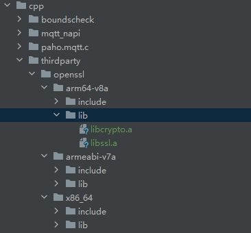

# ohos_mqtt

## 介绍
使应用程序能够连接到MQTT代理以发布消息、订阅主题和接收发布的消息。

## 下载安装

```shell
ohpm install @ohos/mqtt
```


- @ohos/mqtt包已开启ssl功能、已支持sslVersion参数。
- OpenHarmony ohpm环境配置等更多内容，请参考 [如何安装OpenHarmony ohpm包](https://gitcode.com/openharmony-tpc/docs/blob/master/OpenHarmony_har_usage.md) 。

## 源码下载
本项目依赖paho.mqtt.c库和third_party_bounds_checking_function库，通过`git submodule`引入，下载代码时需加上`--recursive`参数。
  ```
  git clone --recursive https://gitcode.com/openharmony-tpc/ohos_mqtt.git
  ```
如需使用sslVersion参数去设置SSL/TLS上下文支持的TLS版本，进入到ohos_Mqtt\src\main\cpp\paho.mqtt.c 目录下，执行 modify.sh 脚本，将本目录下的 patch 文件合入到 paho.mqtt.c 源码中。
## X86模拟器配置

[使用模拟器运行应用/服务](https://developer.huawei.com/consumer/cn/deveco-developer-suite/enabling/kit?currentPage=1&pageSize=100)


## 使用说明

```typescript
    import { MqttAsync } from '@ohos/mqtt';
    // or
    // import { MqttClient } from '@ohos/mqtt';
```

## Demo运行说明
mqtt使用依赖mqtt broker，请使用云服务或自行搭建，将 emqxPage.ets 文件中的如下参数改成对应的值,才能正常运行demo。

```typescript
    // Set Client Configuration
@State topic: string = '';
@State payload: string = '';
@State url: string = '';
@State clientId: string = '';
@State userName: string = "";
@State password: string = "";
@State isMQTTV5: boolean = true;
```
将xts中的domain:port替换成正确的域名与端口，才能正常运行xts.


### openssl依赖
编译ohos_mqtt源码时如果想要开启ssl功能，需要自行编译openssl,[openssl集成到应用hap](https://gitcode.com/openharmony-sig/tpc_c_cplusplus/blob/master/thirdparty/openssl/docs/hap_integrate.md)

1.修改编译之前需要在交叉编译中支持编译x86_64架构，可以参考[adpater_architecture.md](https://gitcode.com/openharmony-sig/tpc_c_cplusplus/blob/master/docs/adpater_architecture.md)文档。

2.编译之前需要先修改HPKBUILD文件中openssl的版本号以及清除MAKE环境变量

  ```
  pkgver=OpenSSL_1_1_1t 
  //修改为
  pkgver=openssl-3.4.0
  
  patchflag=true
  //修改为
  patchflag=false

  prepare() {
    if $patchflag
  //修改为
  prepare() {
    unset MAKE #清除MAKE环境变量
    if $patchflag
  ```


3.下载openssl的[3.4.0版本](https://github.com/openssl/openssl/archive/refs/tags/openssl-3.4.0.tar.gz)，执行以下命令获取对应的sha512值，替换SHA512SUM文件的内容。

  ```
  sha512num openssl-openssl-3.4.0.tar.gz
  ```

4.在cpp目录下新增thirdparty目录，并将编译生成的库拷贝到该目录下，如下图所示



5.在cpp/paho.mqtt.c/CMakeList.txt中添加如下语句

  ```
  #开启ssl
  add_definitions(-DOPENSSL)
  #将三方库加入工程中
  target_link_libraries(pahomqttc PRIVATE ${NATIVERENDER_ROOT_PATH}/thirdparty/openssl/${OHOS_ARCH}/lib/libssl.a)
  target_link_libraries(pahomqttc PRIVATE ${NATIVERENDER_ROOT_PATH}/thirdparty/openssl/${OHOS_ARCH}/lib/libcrypto.a)

  #将三方库的头文件加入工程中
  target_include_directories(pahomqttc PRIVATE ${NATIVERENDER_ROOT_PATH}/thirdparty/openssl/${OHOS_ARCH}/include)
  ```

## 接口说明

### MqttClient

new MqttClient(options: MqttAsyncClientOptions): MqttClient

创建mqtt客户端。

参数：

| 参数名       | 类型                       | 必填       | 说明              |
|-----------|--------------------------|----------|-----------------|
| options   | MqttAsyncClientOptions   | 是        | 客户端参数           |

返回值：

| 类型          | 说明                               |
|-------------|----------------------------------|
| MqttClient  | mqtt客户端，里面包括connect,publish等方法   |

示例：

```typescript
    this.mqttAsyncClient = new MqttClient({
        url: "ip:port",
        clientId: "e5fatos4jh3l79lndb0bs",
        persistenceType: 1,
        MQTTVersion: 5,
    })
```

### createMqtt

createMqtt(options: MqttAsyncClientOptions): MqttClient

创建mqtt客户端。

参数：

| 参数名       | 类型                       | 必填       | 说明              |
|-----------|--------------------------|----------|-----------------|
| options   | MqttAsyncClientOptions   | 是        | 客户端参数           |

返回值：

| 类型          | 说明                               |
|-------------|----------------------------------|
| MqttClient  | mqtt客户端，里面包括connect,publish等方法   |

示例：

```typescript
    this.mqttAsyncClient = MqttAsync.createMqtt({
        url: "ip:port",
        clientId: "e5fatos4jh3l79lndb0bs",
        persistenceType: 1,
        MQTTVersion: 5,
    })
```

### connect
connect(options: MqttConnectOptions, callback: AsyncCallback<MqttResponse>): void

连接mqtt服务器。

参数：

| 参数名        | 类型                                               | 必填    | 说明                                          |
|------------|--------------------------------------------------|-------|---------------------------------------------|
| options    | MqttConnectOptions                               | 是     | 参考[MqttConnectOptions](#mqttconnectoptions) |
| callback   | AsyncCallback< [MqttResponse](#mqttresponse) >   | 是     | 回调函数                                        |

示例1：

```typescript

    let options: MqttConnectOptions = {
        //set userName and password
        userName: "",
        password: "",
        connectTimeout: 30,
        version: 0,
    };
    this.mqttAsyncClient.connect(options, (err: Error, data: MqttResponse) => {
        // to do Something
    });
```

示例2：

连接ssl端口

```typescript

    let options: MqttConnectOptions = {
        //set userName and password
        userName: "",
        password: "",
        connectTimeout: 30,
        version: 0,
        // If connecting to an SSL port, the following parameters need to be configured
        sslOptions: {
          // true: enable server certificate authentication, false: disable,default is true.
          enableServerCertAuth: true,
          // Sandbox path for CA certificate
          // If enableServerCertAuth is true, a CA certificate needs to be passed
          // If enableServerCertAuth is false, a CA certificate does not need to be passed
          // trustStore default value is "/etc/ssl/certs/cacert.pem"
          trustStore: fileDir + "/ca.crt"
        }
    };
    this.mqttAsyncClient.connect(options, (err: Error, data: MqttResponse) => {
        // to do Something
    });
```

### connect
connect(options: MqttConnectOptions): Promise<MqttResponse>

连接mqtt服务器。

参数：

| 参数名       | 类型                     | 必填     | 说明                                               |
|-----------|------------------------|--------|--------------------------------------------------|
| options   | MqttConnectOptions     | 是      | 参考[MqttConnectOptions](#mqttconnectoptions)      |

返回值：

| 类型                                       | 说明                   |
|------------------------------------------|----------------------|
| Promise<[MqttResponse](#mqttresponse)>   | 以Promise形式返回发起连接的结果。 |

示例：

```typescript

    let options: MqttConnectOptions = {
        //set userName and password
        userName: "",
        password: "",
        connectTimeout: 30,
        version: 0,
    };
    this.mqttAsyncClient.connect(options).then((data: MqttResponse) => {
        console.log("mqtt connect success "+ JSON.stringify(data));
    }).catch((err: MqttResponse) => {
        console.log("mqtt connect fail"+JSON.stringify(err))
    })

    try{
        let result: MqttResponse = await this.mqttAsyncClient.connect(options)
        console.log("mqtt connect success "+ JSON.stringify(result));
    }catch(err){
        console.log("mqtt connect fail "+ JSON.stringify(err));
    }
```

示例2：

连接ssl端口

```typescript

    let options: MqttConnectOptions = {
        //set userName and password
        userName: "",
        password: "",
        connectTimeout: 30,
        version: 0,
        // If connecting to an SSL port, the following parameters need to be configured
        sslOptions: {
          // true: enable server certificate authentication, false: disable,default is true.
          enableServerCertAuth: true,
          // Sandbox path for CA certificate
          // If enableServerCertAuth is true, a CA certificate needs to be passed
          // If enableServerCertAuth is false, a CA certificate does not need to be passed
          trustStore: fileDir + "/ca.crt"
        }
    };
    this.mqttAsyncClient.connect(options).then((data: MqttResponse) => {
      console.log("mqtt connect success "+ JSON.stringify(data));
    }).catch((err: MqttResponse) => {
      console.log("mqtt connect fail"+JSON.stringify(err))
    })
    
    try{
      let result: MqttResponse = await this.mqttAsyncClient.connect(options)
      console.log("mqtt connect success "+ JSON.stringify(result));
    }catch(err){
      console.log("mqtt connect fail "+ JSON.stringify(err));
    }
```

### publish
publish(options: MqttPublishOptions, callback: AsyncCallback<MqttResponse>): void

发布消息。

参数：

| 参数名       | 类型                                                | 必填     | 说明                                          |
|-----------|---------------------------------------------------|--------|---------------------------------------------|
| options   | MqttPublishOptions                                | 是      | 参考[MqttPublishOptions](#mqttpublishoptions) |
| callback  | AsyncCallback< [MqttResponse](#mqttresponse) >    | 是      | 回调函数                                        |

示例：

```typescript
    let publishOption: MqttPublishOptions = {
        topic: "domotopic",
        qos: 1,
        payload: "haishangdebing",
    }
    this.mqttAsyncClient.publish(publishOption, (err: Error, data: MqttResponse) => {
        // to do Something
    });
```

### publish
publish(options: MqttPublishOptions): Promise<MqttResponse>

发布消息。

参数：

| 参数名       | 类型                      | 必填     | 说明                                              |
|-----------|-------------------------|--------|-------------------------------------------------|
| options   | MqttPublishOptions      | 是      | 参考[MqttPublishOptions](#mqttpublishoptions)     |

返回值：

| 类型                                       | 说明                 |
|------------------------------------------|--------------------|
| Promise<[MqttResponse](#mqttresponse)>   | 以Promise形式返回发布的结果。 |

示例：

```typescript
    let publishOption: MqttPublishOptions = {
        topic: "domotopic",
        qos: 1,
        payload: "haishangdebing",
        properties: {
            contentType: "application/json",
            userProperties: [
            ["region", "China"],
            ["type", "JSON"],
            ]
        },
    }
    this.mqttAsyncClient.publish(publishOption, (data: MqttResponse) => {
        console.log("mqtt publish success "+ JSON.stringify(data));
    }).catch((err: MqttResponse) => {
        console.log("mqtt publish fail "+ JSON.stringify(err));
    })

    try{
        let result: MqttResponse = await this.mqttAsyncClient.publish(publishOption)
        console.log("mqtt publish success "+ JSON.stringify(result));
    }catch(err){
        console.log("mqtt publish fail "+ JSON.stringify(err));
    }
```

### subscribe
subscribe(options: MqttSubscribeOptions, callback: AsyncCallback<MqttResponse>): void

订阅主题。

参数：

| 参数名       | 类型                                               | 必填     | 说明                                              |
|-----------|--------------------------------------------------|--------|-------------------------------------------------|
| options   | MqttSubscribeOptions                             | 是      | 参考[MqttSubscribeOptions](#mqttsubscribeoptions) |
| callback  | AsyncCallback< [MqttResponse](#mqttresponse) >   | 是      | 回调函数                                            |

示例：

```typescript
    let subscribeOption: MqttSubscribeOptions = {
        topic: "domotopic",
        qos: 2
    }
    this.mqttAsyncClient.subscribe(subscribeOption, (err: Error, data: MqttResponse) => {
        // to do Something
    });
```

### subscribe
subscribe(options: MqttSubscribeOptions): Promise<MqttResponse>

订阅主题。

参数：

| 参数名       | 类型                       | 必填    | 说明                                                 |
|-----------|--------------------------|-------|----------------------------------------------------|
| options   | MqttSubscribeOptions     | 是     | 参考[MqttSubscribeOptions](#mqttsubscribeoptions)    |

返回值：

| 类型                                      | 说明                 |
|-----------------------------------------|--------------------|
| Promise<[MqttResponse](#mqttresponse)>  | 以Promise形式返回订阅的结果。 |

示例：

```typescript
    let subscribeOption: MqttSubscribeOptions = {
        topic: "domotopic",
        qos: 2
    }
    this.mqttAsyncClient.subscribe(subscribeOption).then((data: MqttResponse) => {
        console.log("mqtt subscribe success "+ JSON.stringify(result));
    }).catch((err: MqttResponse) => {
        console.log("mqtt subscribe fail "+ JSON.stringify(err));
    })

    try{
        let result: MqttResponse = await this.mqttAsyncClient.subscribe(subscribeOption)
        console.log("mqtt subscribe success "+ JSON.stringify(result));
    }catch(err){
        console.log("mqtt subscribe fail "+ JSON.stringify(err));
    }
```

### subscribeMany

订阅多个主题

subscribeMany(options: MqttSubscribeOptions[]): Promise<MqttResponse>

参数：

| 参数名       | 类型                     | 必填    | 说明                                                 |
|-----------|------------------------|-------|----------------------------------------------------|
| options   | MqttSubscribeOptions[] | 是     | 参考[MqttSubscribeOptions](#mqttsubscribeoptions)    |

返回值：

| 类型                                      | 说明                 |
|-----------------------------------------|--------------------|
| Promise<[MqttResponse](#mqttresponse)>  | 以Promise形式返回订阅的结果。 |

示例：

```typescript
    let subscribeOption: MqttSubscribeOptions = {
        topic: "domotopic",
        qos: 2
    }
    
    let subscribeOption1: MqttSubscribeOptions = {
      topic: "domotopic1",
      qos: 2
    }
    
    let subscribeOption2: MqttSubscribeOptions = {
      topic: "domotopic2",
      qos: 2
    }
    this.mqttAsyncClient.subscribeMany([subscribeOption, subscribeOption1, subscribeOption2]).then((data: MqttResponse) => {
        console.log("mqtt subscribeMany success "+ JSON.stringify(result));
    }).catch((err: MqttResponse) => {
        console.log("mqtt subscribeMany fail "+ JSON.stringify(err));
    })

    try{
        let result: MqttResponse = await this.mqttAsyncClient.subscribeMany([subscribeOption, subscribeOption1, subscribeOption2])
        console.log("mqtt subscribeMany success "+ JSON.stringify(result));
    }catch(err){
        console.log("mqtt subscribeMany fail "+ JSON.stringify(err));
    }
```

### subscribeMany

订阅多个主题

subscribeMany(options: MqttSubscribeOptions[], callback: AsyncCallback<MqttResponse>): void

参数：

| 参数名       | 类型                                             | 必填     | 说明                                              |
|-----------|------------------------------------------------|--------|-------------------------------------------------|
| options   | MqttSubscribeOptions[]                         | 是      | 参考[MqttSubscribeOptions](#mqttsubscribeoptions) |
| callback  | AsyncCallback< [MqttResponse](#mqttresponse) > | 是      | 回调函数                                            |

示例：

```typescript
    let subscribeOption: MqttSubscribeOptions = {
        topic: "domotopic",
        qos: 2
    }
    
    let subscribeOption1: MqttSubscribeOptions = {
      topic: "domotopic1",
      qos: 2
    }
    
    let subscribeOption2: MqttSubscribeOptions = {
      topic: "domotopic2",
      qos: 2
    }
    this.mqttAsyncClient.subscribeMany([subscribeOption, subscribeOption1, subscribeOption2], (err: Error, data: MqttResponse) => {
        // to do Something
    });
```

### unsubscribe
unsubscribe(options: MqttSubscribeOptions, callback: AsyncCallback<MqttResponse>): void

取消订阅。

参数：

| 参数名        | 类型                                              | 必填       | 说明                                              |
|------------|-------------------------------------------------|----------|-------------------------------------------------|
| options    | MqttSubscribeOptions                            | 是        | 参考[MqttSubscribeOptions](#mqttsubscribeoptions) |
| callback   | AsyncCallback< [MqttResponse](#mqttresponse) >  | 是        | 回调函数                                            |

示例：

```typescript
    let subscribeOption: MqttSubscribeOptions = {
        topic: "domotopic",
        qos: 2
    }
    this.mqttAsyncClient.unsubscribe(subscribeOption, (err: Error, data: MqttResponse) => {
         // to do Something
    });
```

### unsubscribe
unsubscribe(options: MqttSubscribeOptions): Promise<MqttResponse>

取消订阅。

参数：

| 参数名    | 类型                      |必填         | 说明                        |
| -------- | ------------------------ | ---------- | --------------------------- |
| options  | MqttSubscribeOptions       | 是         | 参考[MqttSubscribeOptions](#mqttsubscribeoptions)     |

返回值：

| 类型                                     | 说明                   |
|----------------------------------------|----------------------|
| Promise<[MqttResponse](#mqttresponse)> | 以Promise形式返回取消订阅的结果。 |

示例：

```typescript
    let subscribeOption: MqttSubscribeOptions = {
        topic: "domotopic",
        qos: 2
    }
    this.mqttAsyncClient.unsubscribe(subscribeOption).then((data: MqttResponse) => {
        console.log("mqtt unsubscribe success "+ JSON.stringify(result));
    }).catch((err: MqttResponse) => {
        console.log("mqtt unsubscribe fail "+ JSON.stringify(err));
    })

    try{
        let result: MqttResponse = await this.mqttAsyncClient.unsubscribe(subscribeOption)
        console.log("mqtt unsubscribe success "+ JSON.stringify(result));
    }catch(err){
        console.log("mqtt unsubscribe fail "+ JSON.stringify(err));
    }
```

### unsubscribeMany

取消多个主题的订阅

unsubscribeMany(options: MqttSubscribeOptions[]): Promise<MqttResponse>

参数：

| 参数名    | 类型                     |必填         | 说明                        |
| -------- |------------------------| ---------- | --------------------------- |
| options  | MqttSubscribeOptions[] | 是         | 参考[MqttSubscribeOptions](#mqttsubscribeoptions)     |

返回值：

| 类型                                     | 说明                   |
|----------------------------------------|----------------------|
| Promise<[MqttResponse](#mqttresponse)> | 以Promise形式返回取消订阅的结果。 |

示例：

```typescript
    let subscribeOption: MqttSubscribeOptions = {
        topic: "domotopic",
        qos: 2
    }

    let subscribeOption1: MqttSubscribeOptions = {
      topic: "domotopic1",
      qos: 2
    }
    
    let subscribeOption2: MqttSubscribeOptions = {
      topic: "domotopic2",
      qos: 2
    }
    this.mqttAsyncClient.unsubscribeMany([subscribeOption, subscribeOption1, subscribeOption2]).then((data: MqttResponse) => {
        console.log("mqtt unsubscribeMany success "+ JSON.stringify(result));
    }).catch((err: MqttResponse) => {
        console.log("mqtt unsubscribeMany fail "+ JSON.stringify(err));
    })

    try{
        let result: MqttResponse = await this.mqttAsyncClient.unsubscribeMany([subscribeOption, subscribeOption1, subscribeOption2])
        console.log("mqtt unsubscribeMany success "+ JSON.stringify(result));
    }catch(err){
        console.log("mqtt unsubscribeMany fail "+ JSON.stringify(err));
    }
```

### unsubscribeMany

取消多个主题的订阅

unsubscribeMany(options: MqttSubscribeOptions[], callback: AsyncCallback<MqttResponse>): void

参数：

| 参数名        | 类型                                             | 必填       | 说明                                              |
|------------|------------------------------------------------|----------|-------------------------------------------------|
| options    | MqttSubscribeOptions[]                         | 是        | 参考[MqttSubscribeOptions](#mqttsubscribeoptions) |
| callback   | AsyncCallback< [MqttResponse](#mqttresponse) > | 是        | 回调函数                                            |

示例：

```typescript
    let subscribeOption: MqttSubscribeOptions = {
      topic: "domotopic",
      qos: 2
    }
    
    let subscribeOption1: MqttSubscribeOptions = {
      topic: "domotopic1",
      qos: 2
    }
    
    let subscribeOption2: MqttSubscribeOptions = {
      topic: "domotopic2",
      qos: 2
    }
    this.mqttAsyncClient.unsubscribeMany([subscribeOption, subscribeOption1, subscribeOption2], (err: Error, data: MqttResponse) => {
         // to do Something
    });
```

### messageArrived
messageArrived(callback: AsyncCallback<MqttMessage>): void

接收消息，使用此接口后，当订阅的主题有消息发布时，会自动接收到消息。

参数：

| 参数名         | 类型                                             | 必填      | 说明         |
|-------------|------------------------------------------------|---------|------------|
| callback    | AsyncCallback< [MqttMessage](#mqttmessage) >   | 是       | 回调函数       |

示例：

```typescript
    this.mqttAsyncClient.messageArrived((err: Error, data: MqttMessage) => {
        // to do Something
    });
```

### disconnect
disconnect(callback: AsyncCallback<MqttResponse>): void

断开连接。

参数：

| 参数名        | 类型                                               | 必填        | 说明          |
|------------|--------------------------------------------------|-----------|-------------|
| callback   | AsyncCallback< [MqttResponse](#mqttresponse) >   | 是         | 回调函数        |

示例：

```typescript
    this.mqttAsyncClient.disconnect((err: Error, data: MqttResponse) => {
        // to do Something
    });
```

### disconnect
disconnect(): Promise<MqttResponse>

断开连接。

返回值：

| 类型                                       | 说明                   |
|------------------------------------------|----------------------|
| Promise<[MqttResponse](#mqttresponse)>   | 以Promise形式返回断开连接的结果。 |

示例：

```typescript
    this.mqttAsyncClient.disconnect().then((data: MqttResponse) => {
        console.log("mqtt disconnect success "+ JSON.stringify(result));;
    }).catch((err: MqttResponse) => {
        console.log("mqtt disconnect fail "+ JSON.stringify(err));
    })

    try{
        let result: MqttResponse = await this.mqttAsyncClient.disconnect()
        console.log("mqtt disconnect success "+ JSON.stringify(result));
    }catch(err){
        console.log("mqtt disconnect fail "+ JSON.stringify(err));
    }
```

### connectLost
connectLost(callback: AsyncCallback<MqttResponse>): void

当被动的断开连接后的回调（比如断网），可以在回调中尝试重新连接。

参数：

| 参数名    | 类型                      |必填         | 说明                        |
| -------- | ------------------------ | ---------- | --------------------------- |
| callback  | AsyncCallback< [MqttResponse](#mqttresponse) >    | 是         | 回调函数                |

示例：

```typescript
    this.mqttAsyncClient.connectLost((err: Error, data: MqttResponse) => {
        // to do Something
    });
```

### isConnected
isConnected(): Promise<boolean>

是否已连接。

返回值：

| 类型               | 说明                     |
|------------------|------------------------|
| Promise<boolean> | 以Promise形式返回判断是否连接的结果。 |

示例：

```typescript
    this.mqttAsyncClient.isConnected().then((data: boolean) => {
        console.log("result: "+data)
    });

    let result: boolean = await this.mqttAsyncClient.isConnected() //true or false
```

### reconnect
reconnect(): Promise<boolean>

重新连接（必须之前连接过）。

返回值：

| 类型               | 说明                  |
|------------------|---------------------|
| Promise<boolean> | 以Promise形式返回重连的的结果。 |

示例：

```typescript
    this.mqttAsyncClient.reconnect().then((data: boolean) => {
        console.log('result: ' + data)
    });

    let result: boolean = await this.mqttAsyncClient.reconnect() //true or false
```

### destroy
destroy(): Promise<boolean>

销毁客户端。

返回值：

| 类型               | 说明                 |
|------------------|--------------------|
| Promise<boolean> | 以Promise形式返回销毁的结果。 |


示例：

```typescript
    this.mqttAsyncClient.destroy().then((data: boolean) => {
        console.log('result: ' + data)
    });

    let result: boolean = await this.mqttAsyncClient.destroy() //true or false
```

### setMqttTrace
setMqttTrace(level: MQTTASYNC_TRACE_LEVELS): void

设置hilog中跟踪信息的级别。

```typescript
    this.mqttAsyncClient.setMqttTrace(6);
```

参数：

| 参数名    | 类型                      |必填         | 说明                        |
| -------- | ------------------------ | ---------- | --------------------------- |
| level  | MQTTASYNC_TRACE_LEVELS    | 是         | 消息跟踪级别                |

### MQTTASYNC_TRACE_LEVELS

消息跟踪级别

| 名称                       | 值    |
|--------------------------| ----- |
| MQTTASYNC_TRACE_MAXIMUM  | 1    | 
| MQTTASYNC_TRACE_MEDIUM   | 2    | 
| MQTTASYNC_TRACE_MINIMUM  | 3    | 
| MQTTASYNC_TRACE_PROTOCOL | 4    | 
| MQTTASYNC_TRACE_ERROR    | 5    | 
| MQTTASYNC_TRACE_SEVERE   | 6    | 
| MQTTASYNC_TRACE_FATAL    | 7    | 

### MqttAsyncClientOptions

创建客户端可选参数的类型和可选范围

| 参数名    | 类型                      |必填         | 说明                        |
| -------- | ------------------------ | ---------- | --------------------------- |
| url      | string    | 是         | 以null结尾的字符串，指定客户端将连接到的服务器。它采取的形式protocol://host:port.protocol必须是tcp、ssl、ws或wss。对于主机，可以指定IP地址或主机名。例如，tcp://localhost:1883                |
| clientId  | string    | 是         | 客户端连接到服务器时传递给服务器的客户端标识符。它是一个以空结尾的UTF-8编码字符串                |
| persistenceType  | PersistenceType    | 否         | 客户端使用的持久性类型，0=使用默认（基于文件系统）持久性机制(不支持)。1=默认值：在内存持久性中使用。2=使用特定于应用程序的持久性实现(不支持)     |

### MqttConnectOptions

客户端连接服务器可选参数的类型和可选范围

| 参数名                 | 类型            |必填     | 默认值    | 说明                                                                    |
| --------------------- | ---------------| -------| -------- |-----------------------------------------------------------------------|
| cleanSession          | boolean        | 否      |  true    | 这是一个布尔值。设置控制客户端和服务器在连接和断开连接时的行为                                       |
| connectTimeout        | number         | 否      |  30s     | 设置连接超时时间，默认                                                           |
| keepAliveInterval     | number         | 否      |  60s      | 保持活动间隔                                                                |
| serverURIs            | Array<string>  | 否      |           | 客户端连接到的服务器url                                                         |
| retryInterval         | number         | 否      |   0       | 未确认的发布请求的时间间隔                                                         |
| sslOptions            | number         | 否      |           | 参考[sslOptions](#ssloptions)                                           |
| willOptions           | number         | 否      |           | 参考[willOptions](#willoptions)                                         |
| MQTTVersion           | number         | 否      |   0       | 设置要在连接上使用的MQTT版本， 0=默认值：从3.1.1开始，如果失败，则返回到3.1，3=仅尝试版本3.1，4=仅尝试3.1.1版本, 5=仅尝试5版本 |
| automaticReconnect    | boolean        | 否      |   false   | 是否在连接丢失的情况下自动重新连接，当前不支持                                               |
| minRetryInterval      | number         | 否      |   1s      | 以秒为单位的最小重试间隔。每次重试失败时加倍                                                |
| maxRetryInterval      | number         | 否      |   60s     | 以秒为单位的最大重试间隔。重试失败时，加倍在此停止                                             |
| userName              | string         | 否      |           | 用户名                                                                   |
| password              | string         | 否      |            | 密码                                                                    |

### sslOptions

ssl连接的可选参数的类型的可选的范围。

| 参数名                    | 类型                                             | 必填       | 默认值                               | 说明                                                                         |
|------------------------|------------------------------------------------|----------|-----------------------------------|----------------------------------------------------------------------------|
| enableServerCertAuth   | boolean                                        | 否        | true                              | 是否启用服务器证书身份验证                                                              |
| verify                 | boolean                                        | 否        | false                             | 是否验证主机名                                                                    |
| caPath                 | string                                         | 否        | NULL                              | 如果CApath不为NULL，则它指向包含PEM格式的CA证书的目录                                         |
| trustStore             | string                                         | 否        | 系统证书："/etc/ssl/certs/cacert.pem"  | PEM格式的文件，其中包含客户端信任的公共数字证书。它必须在设备中设置本地文件路径，并且必须可以访问该文件。                     |
| keyStore               | string                                         | 否        | NULL                              | PEM格式的文件，包含客户端的公共证书链。它还可能包括客户端的私钥。它必须在设备中设置本地文件路径，并且必须可以访问该文件              |
| privateKey             | string                                         | 否        | NULL                              | 如果未包含在sslKeyStore中，则此设置指向PEM格式的文件，该文件包含客户端的私钥。它必须在设备中设置本地文件路径，并且必须可以访问该文件。 |
| privateKeyPassword     | string                                         | 否        | NULL                              | 如果加密，则加载客户端私钥的密码                                                           |
| enabledCipherSuites    | string                                         | 否        | “ALL”                             | 客户端将在SSL握手期间呈现给服务器的密码套件列表。如果忽略此设置，其默认值将为“ALL”，即，将考虑所有密码套件，不包括不提供加密的套件      |
| sslVersion             | [MQTT_SSL_VERSION](#MQTT_SSL_VERSION)          | 否        | 0                                 | 设置SSL/TLS上下文支持的TLS版本                                                       |

### MQTT_SSL_VERSION

TLS版本

| 名称                         | 值   |
|----------------------------|-----|
| MQTT_SSL_VERSION_DEFAULT   | 0   | 
| MQTT_SSL_VERSION_TLS_1_0   | 1   | 
| MQTT_SSL_VERSION_TLS_1_1   | 2   | 
| MQTT_SSL_VERSION_TLS_1_2   | 3   |

### willOptions

定义客户机的MQTT“Last Will and Testament”（LWT）设置。如果客户端意外断开与服务器的连接，服务器将代表客户端将LWT消息发布到LWT主题。这允许别的客户端（订阅了LWT主题）知道客户端已断开连接。

| 参数名                 | 类型            |必填     | 默认值    | 说明                        |
| --------------------- | ---------------| -------| -------- | --------------------------- |
| topicName             | string         | 是      |          |主题名称     |
| message               | string         | 是      |          |发布的消息     |
| retained              | boolean        | 否      |   false  |是否保留此消息     |
| qos                   | QoS            | 否      |   0      |LWT消息的服务质量设置     |

### MqttSubscribeOptions

发布消息可选参数类型的可选范围

| 参数名                 | 类型            |必填     | 默认值    | 说明                        |
| --------------------- | ---------------| -------| -------- | --------------------------- |
| topic             | string         | 是      |          |主题名称     |
| qos                   | QoS            | 是      |   0      |消息的服务质量设置 。    |

### MqttPublishOptions

订阅主题的可选参数类型和可选范围

| 参数名                 | 类型            |必填     | 默认值    | 说明                       |
| --------------------- | ---------------| -------| -------- |--------------------------|
| topic                 | string         | 是      |          | 主题名称                     |
| payload               | string         | 可选    |          | 发布的消息                    |
| payloadBinary         | ArrayBuffer    | 可选    |          | 发布的消息                    |
| qos                   | QoS            | 是      |          | 消息的服务质量设置                |
| retained              | boolean        | 否      |   false  | 是否保留此消息                  |
| dup                   | boolean        | 否      |   false  | 此消息是否重复，它仅在接收QoS1消息时才有意义 |
| msgid                 | number         | 否      |   0      | 消息标识符保留供MQTT客户机和服务器内部使用  |
| properties            | [Properties](#properties) | 否      |         | 发布的属性  |

### MqttResponse

mqtt接口的返回值类型

| 参数名    | 类型                      |必填         | 说明                        |
| -------- | ------------------------ | ---------- | --------------------------- |
| message  | string    | 是         | 返回接口调用信息 ，成功或失败               |
| code     | number    | 是         | 如果返回值0，则操作成功。                |
| reasonCode | number    | 是         | 返回接口调用成功或失败的原因码。                |
| properties | [Properties](#properties)    | 是         | 返回接口调用属性信息。                |

### MqttMessage

messageArrived接口的返回类型

| 参数名    | 类型                      |必填         | 说明                        |
| -------- | ------------------------ | ----------  | --------------------------- |
| topic                 | string         | 是       |主题名称     |
| payload               | string         | 可选     |发布的消息     |
| payloadBinary         | ArrayBuffer    | 可选     |发布的消息     |
| qos                   | QoS            | 是       |消息的服务质量设置     |
| retained              | number         | 是       |是否保留此消息     |
| dup                   | number         | 是       |此消息是否重复，它仅在接收QoS1消息时才有意义     |
| msgid                 | number         | 是       |消息标识符保留供MQTT客户机和服务器内部使用     |
| properties            | [Properties](#properties) | 可选       |发布的属性     |

### Properties

Properties属性

| 参数名    | 类型                      |必填         | 说明                        |
| -------- | ------------------------ | ----------  | --------------------------- |
| contentType                 | string         | 否       |发布的内容类型     |
| userProperties              | UserPropertiesType[]         | 否       |发布的用户属性     |
| integerProperties           | number[]         | 否       |发布的整型属性     |
| strProperties               | string[]         | 否       |发布的字符串属性     |


[单元测试用例详情](https://gitcode.com/openharmony-tpc/ohos_mqtt/blob/master/TEST.md)

## 约束与限制
在下述版本验证通过：

- DevEco Studio: NEXT Beta1-5.0.3.806, SDK: API12 Release (5.0.0.66)
- DevEco Studio: DevEco Studio NEXT Developer Beta1-5.0.3.331 SDK: API12 (5.0.0.25(SP6))

## 目录结构
````
|----ohos_mqtt  
|     |---- entry  # 示例代码文件夹
|     |---- ohos_Mqtt  # ohos_Mqtt库文件夹
|                |---- cpp # c/c++和napi代码
|                      |---- mqtt_napi # mqtt的napi逻辑代码
|                      |---- CMakeLists.txt  # 构建脚本
|                      |---- boundscheck # 子模块third_party_bounds_checking_function
|                      |---- paho.mqtt.c # 子模块paho.mqtt.c
|                |---- ets # 接口声明
|           |---- index.ets  # 对外接口
|     |---- README.md  # 安装使用方法          
|     |---- README_zh.md  # 安装使用方法            
````

## 关于混淆
- 代码混淆，请查看[代码混淆简介](https://docs.openharmony.cn/pages/v5.0/zh-cn/application-dev/arkts-utils/source-obfuscation.md)
- 如果希望mqtt库在代码混淆过程中不会被混淆，需要在混淆规则配置文件obfuscation-rules.txt中添加相应的排除规则：

```
-keep
./oh_modules/@ohos/mqtt
```

## 贡献代码
使用过程中发现任何问题都可以提 [Issue](https://gitcode.com/openharmony-tpc/ohos_mqtt/issues) 给组件，当然，也非常欢迎给发 [PR](https://gitcode.com/openharmony-tpc/ohos_mqtt/pulls)共建 。

## 开源协议
本项目基于 [Eclipse Public License - v 2.0](https://gitcode.com/openharmony-tpc/ohos_mqtt/blob/master/LICENSE) ，请自由地享受和参与开源。 
    


